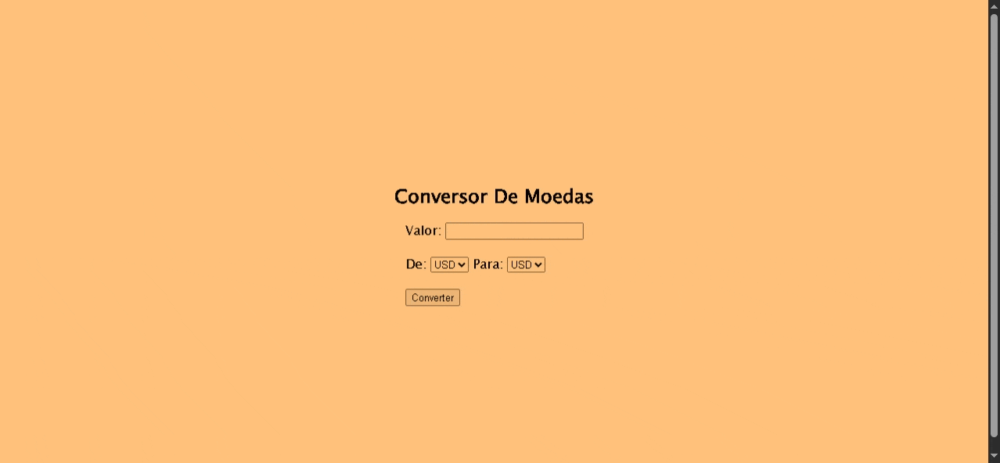

# 💱 Currency Converter

Um conversor de moedas feito em **Python**, usando:

- A biblioteca `requests` para acessar uma **API de câmbio**
- A biblioteca `Flask` para criar uma **interface web**
- **Programação orientada a objetos (POO)** com classes para organizar o código

---

## O que esse projeto faz

- Converte valores entre moedas (ex: dólar → real, euro → )
- Usa taxas de câmbio **atualizadas em tempo real**
- Mostra uma interface simples no navegador

---

## Tecnologias

- Python 3
- [Flask](https://flask.palletsprojects.com/) – cria o site local
- [Requests](https://docs.python-requests.org/en/latest/) – faz requisições HTTP
- API de câmbio (como [ExchangeRate API](https://www.exchangerate-api.com/) ou [Exchangeratesapi.io](https://exchangeratesapi.io/))

---

## Como instalar e rodar

1. **Clone o repositório:**

```bash
git clone https://github.com/seu-usuario/currency_converter.git
cd currency_converter
```




